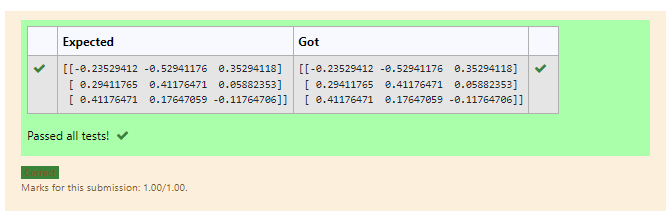

# INVERSE-OF-A-MATRIX
## Aim:
To write a python program to find the inverse of a matrix.
## Equipment’s required:
1. 	Hardware – PCs
2. 	Anaconda – Python 3.7 Installation / Moodle-Code Runner
## Algorithm:
### Step1 :
Import the numpy module to the function. 
### Step 2:
Give the values using np.array() 
### Step 3:
Name the array as values and print the values.
### Step 4:
End the program. 

## Program:
```
#Program to find the inverse of a matrix.
#Developed by: Manoj kumar.S
#RegisterNumber:21500146
import numpy as np
B=np.array([[1,0,3],
           [-1,2,-2],
           [2,3,-1]])
values=np.linalg.inv(B)
print(values)
```
## Output:

## Result:
Thus the inverse of given matrix is successfully solved using python program

